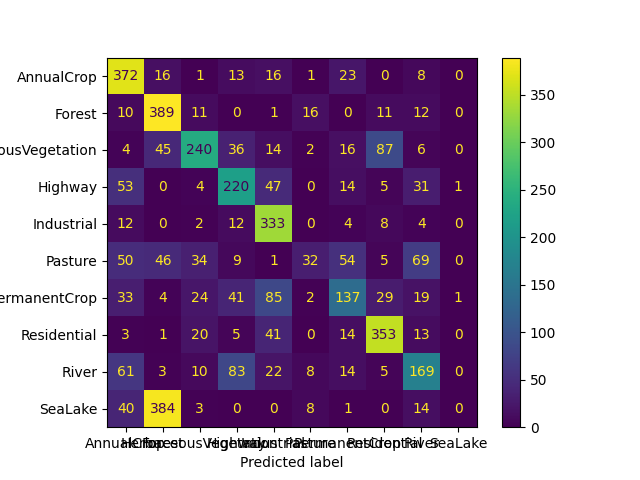

# Satellite Image Representations for Quantum Classifiers
Code repository for the article "Satellite Image Representations for Quantum Classifiers" in the special issue of Datenbank-Spektrum "Data Management on Quantum Hardware".

## Setup
We provide a Dockerfile for an easy setup.
Clone the repository and, in the top-level directory, execute:
```bash
docker build -t sirfqc .
```
Then, start the container.

### Data
The EuroSAT dataset can be downloaded [here](https://madm.dfki.de/files/sentinel/EuroSAT.zip).
The NWPU-RESISC45 dataset can be downloaded [here](https://1drv.ms/u/s!AmgKYzARBl5ca3HNaHIlzp_IXjs).

## Getting started
To train a model with default parameters (Data: EuroSAT AnnualCrop vs SeaLake, Transformation: VGG16+AE, Classifier: FVQC), simply execute:
```bash
python train.py
```

To get information and help on the parameters and possible arguments for the script, run:
```bash
python train.py -h
```

To train models for a one-versus-rest multiclass classification with default parameters (Data: EuroSAT, Transformation: VGG16+AE, Classifier: FVQC), execute:
```bash
python train_ovr.py
```

|  |
|:--:|
| *Confusion matrix as an example result for a one-versus-rest multiclass classification of the EuroSAT dataset with VGG16, autoencoder and FVQC.* |
